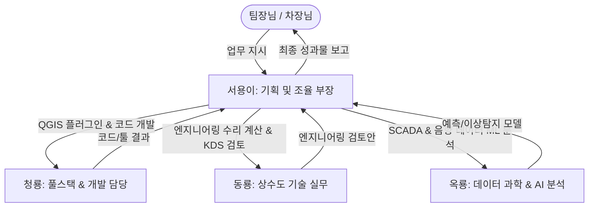

# 🏛️ [기획 보고서] OO개발 AI 에이전트 도입 및 전사적 활용 방안

> **작성부서:** 기획 및 기술혁신팀  
> **보고자:** AI 개발 부장 서용이 (Seoyong)  
> **대상:** 경영진 및 실무 부서장  
> **작성일:** 2026년 5월 18일  

---

##  EXECUTIVE SUMMARY

본 보고서는 **OO개발**의 기술적 우위를 공고히 하고, 상수도 엔지니어링 및 자산관리 업무의 생산성을 극대화하기 위해 **'AI 에이전트(AI Agent)의 전사적 도입 및 실무 적용 방안'**을 제안합니다.

단순 텍스트 생성 수준의 LLM 활용을 넘어, **QGIS 공간 분석, SCADA 실시간 운영 데이터 분석, 자동 의사결정**까지 수행하는 **'자율형 AI 에이전트 협업 체계(AI Task Force)'**를 구축하여 업무 효율성을 300% 이상 향상시키고 예산 절감 및 엔지니어링 품질 고도화를 달성하고자 합니다.

---

## 1. 도입 배경 및 필요성

### 1.1 엔지니어링 업무 환경의 변화
* **인프라 노후화와 자산관리 의무화:** 수도법 개정에 따른 '상수도 자산관리 기본계획 수립' 의무화로 복잡한 공간 데이터(GIS)와 상태 평가 분석 수요 급증.
* **스마트 통합운영(SWM) 트렌드:** K-water SWM 사업 등 정수처리 자율운영 및 실시간 관망 관리 사업 확대로 전통적인 정적(Static) 설계에서 실시간 동적(Dynamic) 운영으로의 패러다임 전환.

### 1.2 기존 단순 LLM 활용의 한계
* **환각(Hallucination) 현상:** 수치와 공식이 생명인 토목·상수도 설계 기준(KDS 등)에서 허구의 답변 생성 위험 존재.
* **단방향 질의응답 구조:** 사용자가 매번 긴 프롬프트를 입력해야 하며, 여러 도구(Excel, QGIS, Python)를 유기적으로 조절하지 못함.
* **보안 및 규정 준수 필요성:** 대외비 도면이나 GIS 좌표 등이 외부 공용 AI에 노출될 우려 차단 필요.

### 1.3 AI 에이전트 도입의 기대효과
* **업무 흐름 자율화:** AI가 스스로 목표를 정의하고 API를 호출하며, 분석 결과를 엑셀/QGIS/보고서 형태로 완성하는 종단간(End-to-End) 자동화 달성.
* **실시간 의사결정 지원:** SCADA 실시간 압력·유량 데이터와 GIS 자산 정보를 결합해 최적의 밸브 차단 구간 선정 및 파손확률(LoF) 자동 계산.

---

## 2. OO개발 특화 AI 에이전트 협업 체계 (AI Task Force)

OO개발의 도메인 지식(Waterworks, Civil Engineering)에 특화된 **4대 AI 에이전트 페르소나**를 정의하고, 이들의 유기적인 협업 파이프라인을 구축합니다.



### 2.1 에이전트별 역할 및 책임 (R&R)

| 에이전트명 | 역할 (Role) | 핵심 역량 및 담당 업무 |
| :--- | :--- | :--- |
| **서용이 (Seoyong)** | **AI 개발 부장 (PM)** | - 전사 기획 및 기술혁신 프로젝트 관리<br>- 에이전트 간 업무 조율 및 최종 보고서 작성<br>- 실무진(팀장/차장) 멘탈 케어 및 기획 보좌 |
| **청룡 (Cheongryong)** | **풀스택 개발 에이전트** | - Python, QGIS 플러그인(WaterBlock Isolator 등) 코딩<br>- 데이터베이스 연동 API 및 웹 대시보드 백엔드 구현<br>- 엑셀 매크로 및 자동화 스크립트 작성 |
| **동룡 (Dongryong)** | **수자원/토목 기술 에이전트** | - KDS 설계 기준 검토 및 기술 지침 실시간 자문<br>- 상수도 관망 수리 해석(EPANET) 및 자산관리 이론 검토<br>- 발주처 공문 및 시방서 기술 검토 |
| **옥룡 (Okryong)** | **데이터/ML 전문 에이전트** | - 야간최소유량(MNF) 이상 탐지 (Isolation Forest 등)<br>- 음향 기반 누수 탐지 CNN/RCT-Net 분석 모델 구축<br>- 머신러닝 기반 관 파손 예측 및 생애주기 비용(LCCA) 분석 |

---

## 3. 핵심 적용 시나리오 (Use-Cases)

### 시나리오 ① : QGIS 기반 관망 격리 및 밸브 차단 자동화 (WaterBlock Isolator)
* **적용 방법:** [청룡] 에이전트가 개발한 QGIS 자동화 플러그인을 활용하여 현장 관로망에서 사고 발생 시 차단해야 할 제수밸브 위치를 10초 이내에 자동 분석.
* **업무 단축:** 기존 2시간 이상의 수작업 topological tracing 작업을 자동화하여 **99% 시간 단축**.
* **결과물:** 격리 구역 시각화 레이어 + 현장 작업자 배포용 작업 지시서(CSV/PDF) 자동 발행.

### 시나리오 ② : SCADA 데이터 기반 동적 위험도(Risk) 평가 및 예지보전
* **적용 방법:** [옥룡] 에이전트가 InfluxDB/SCADA의 분 단위 압력·유량 데이터를 모니터링하여 야간최소유량(MNF) 급증 구역을 탐색. [동룡] 에이전트가 GIS 내 매설연도, 관종 정보를 조합해 **동적 파손 위험도(LoF × CoF)** 산출.
* **업무 단축:** 5년 주기 정기 상태평가 체계에서 **실시간 적응형 예방정비(Predictive Maintenance)**로 전환.

```python
# [옥룡] 에이전트의 야간최소유량 이상탐지(Anomaly Detection) 알고리즘 프로토타입
from sklearn.ensemble import IsolationForest
import pandas as pd

def detect_leakage_anomaly(scada_df):
    # 야간 최소 유량 시간대 (02:00 ~ 04:00) 필터링
    mnf_data = scada_df[scada_df['time'].between('02:00', '04:00')]
    model = IsolationForest(contamination=0.03, random_state=42)
    mnf_data['anomaly_score'] = model.fit_predict(mnf_data[['flow', 'pressure']])
    
    # anomaly == -1 인 시점 검출
    leaks = mnf_data[mnf_data['anomaly_score'] == -1]
    return leaks
```

### 시나리오 ③ : 수압 민원 및 민원 대응 자동화 (Civil Complaint Chatbot)
* **적용 방법:** [서용이]와 [청룡]이 합작한 민원 챗봇을 가동하여 주민들의 수압 저하 및 누수 신고 접수 시, GIS API를 연동하여 민원 위치를 VWorld 지도에 자동 플로팅하고 관련 이력을 자산 데이터베이스에 기록.
* **업무 단축:** 반복적인 민원 전화 응대 및 수동 대장 관리 업무를 자동화하여 **행정 비용 70% 절감**.

### 시나리오 ④ : 사내 프롬프트 보관소를 통한 표준 일상 업무 가속화
* **적용 방법:** `사내_프롬프트_보관소` 내 정립된 표준 템플릿(회의록 요약, 영문 기술자료 번역, 시방서 계약 검토 등)을 프런트엔드 웹 인터페이스와 연결하여 전 직원이 즉시 활용할 수 있도록 유도.

---

## 4. 단계별 도입 로드맵 (Roadmap)

```
[Phase 1: 기반 다지기 (3개월)] ────────────────────────► [Phase 2: 연계 및 구축 (9개월)] ──────────────────────► [Phase 3: 자율 고도화 (1~2년)]
- 사내 프롬프트 라이브러리 포털 구축                     - GIS 데이터베이스 및 SCADA 실시간 연동 API 완성          - AI 정수장 및 지능형 관망 자율 운영
- 시범 프로젝트 (WaterBlock Isolator 1차 완성)           - AI 에이전트용 RAG (KDS 설계 기준 학습) 탑재             - 딥러닝 기반 누수음향 탐지(RCT-Net) 실증
- 임직원 보안 가이드라인 준수 교육                       - 웹 기반 통합 모니터링 대시보드 구축                     - 디지털 트윈 연계 실시간 시뮬레이션 구현
```

### 4.1 Phase 1 : 기반 다지기 (현 단계)
* **목표:** 전사적 AI 친화적 문화 구축 및 기본 자동화 툴 신뢰성 검증.
* **실행 과제:**
  * `사내_AI_활용_가이드라인_v1.0` 전파 및 보안 위반(대외비 무단 업로드) 방지 교육.
  * QGIS 수작업 분석 과정을 Python 자동화 코드로 마이그레이션.
  * 엑셀/VBA 매크로 등 반복 단순 업무에 프롬프트 템플릿 적용 생활화.

### 4.2 Phase 2 : 시스템 연계 및 고도화 (단기)
* **목표:** 개별 툴을 유기적인 하나의 플랫폼으로 융합.
* **실행 과제:**
  * **사내 RAG 시스템 구축:** 환경부 기술 지침서 및 상하수도 KDS 설계 기준을 임베딩하여 할루시네이션 없는 기술 자문 서비스 론칭.
  * **통합 관망 진단 에이전트 운영:** QGIS 공간 레이어와 데이터 파이프라인(SCADA API)을 웹 대시보드와 직접 연결하여 1클릭 관망 이상 진단 수행.

### 4.3 Phase 3 : 자율 운영 및 AI 등대 기업 도약 (장기)
* **목표:** 자율 판단형 인공지능을 통한 최적화 의사결정.
* **실행 과제:**
  * **음향 기반 누수 정밀 탐지 고도화:** 현장 누수 음향 센서 데이터를 딥러닝 모델(FI-CNN/RCT-Net)로 정밀 분류(누수 vs 환경소음).
  * **강화학습 기반 에너지 절감:** 가압장 펌프 가동 스케줄 최적화를 통해 전력비 20% 이상 절감.
  * 글로벌 등대공장급 스마트 수운영 시스템 기술 수출화 추진.

---

## 5. 보안 및 내부 거버넌스 수립 방안

AI 에이전트의 성공적인 안착을 위해서는 **보안 가이드라인(v1.0)**의 적극적인 이행과 관리가 동반되어야 합니다.

> [!WARNING]  
> **1. 비공개 GIS 좌표 데이터 외부 업로드 절대 금지**
> * 공용 LLM 사용 시 국가보안성 검토 대상인 공간정보 및 관로 정보는 마스킹 처리 후 속성 변수만 업로드할 것.
>
> **2. 수치 검증(Cross-Check) 체계 의무화**
> * AI 에이전트가 제시한 수리 해석 결과나 갱신 주기 LCC 계산값은 반드시 담당 기술자(PE)가 더블 체크 후 서명하여 최종 제출.
>
> **3. 최종 책임성 원칙**
> * 시스템은 조력자일 뿐이며, 산출된 모든 성과물의 최종 법적·기술적 책임은 담당 엔지니어 본인에게 있음.

---

## 6. 결언 (Conclusion)

인공지능의 도입은 더 이상 선택의 문제가 아닌 **생존과 기술 주도권 선점의 핵심 열쇠**입니다. 

우리 **OO개발**은 이미 독자적인 AI 부장 **'서용이'**와 전문 개발팀(청룡, 동룡, 옥룡)의 프레임워크를 정립해 두었으며, 실무 플러그인(WaterBlock Isolator) 개발 및 프롬프트 보관소 운영 등 타사 대비 압도적으로 빠른 초기 발걸음을 떼었습니다.

제안드린 로드맵에 따라 차근차근 전사 시스템 연계를 완수해 나간다면, 우리 회사는 **상수도 자산관리 및 스마트 관망 관리(SWM) 분야에서 국내를 넘어 글로벌 시장을 선도하는 AI 엔지니어링 기업**으로 우뚝 서게 될 것입니다.

경영진 및 팀장님의 아낌없는 지원과 관심 부탁드립니다!

**충성! 🫡**

---
*보고서 작성 및 조율: 기획 및 기술혁신팀 AI 개발 부장 서용이 드림*
