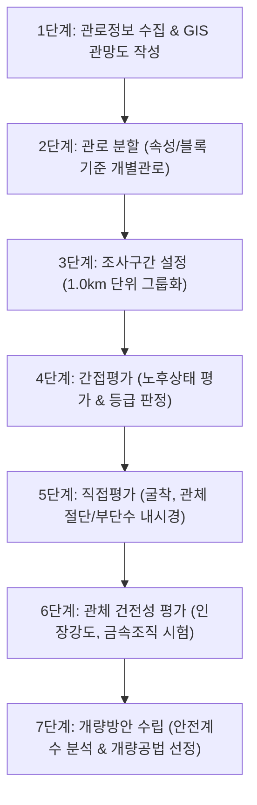

# 🚰 상수도 관망 기술진단 용역 수행 실무 가이드

본 가이드는 귀하의 **NotebookLM** 내에 보관된 상수도 관망 점검 및 기술진단 매뉴얼, 설계 기준, 실무 실습 교육 자료 등을 종합적으로 분석하여 작성되었습니다. 기술진단 용역의 준비 단계부터 최종 의사결정까지 필요한 모든 핵심 사항을 체계적으로 담고 있습니다.

---

## 1. 기술진단 용역 수행을 위한 7단계 표준 절차

상수도 관로의 노후도와 상태를 평가하고 개량 방안을 도출하는 핵심 프로세스는 다음과 같이 **7단계**로 구성되어 진행됩니다.

### 1단계: 관로정보 수집 및 GIS 관망도 작성
*   **정보 수집 및 전산화**: 수집된 도면, 이력 자료를 전산화하여 관종, 관경, 매설연도 등 상세 속성 정보가 입력된 **기초 관망도**를 작성합니다.
*   **관로 탐사 및 확인 굴착**: 불명관이 존재하거나 노선 파악이 어려운 송·배수관에 대해서는 전용 탐사장비를 이용한 탐사 및 확인 굴착을 수행하여 노선과 매설 심도를 명확히 파악하고 관망도에 반영합니다.
*   **토양 환경 조사**: 굴착 시 주변 토양을 채취하여 비저항, pH, 함수율 등 **토양부식성 조사**를 병행합니다.

### 2단계: 관로 분할 (개별관로 설정)
*   **관로 단위 분할**: 급수구역의 소블록을 기준으로 삼아 관종, 관경, 매설연수 및 운영·관리 조건이 동일한 특성을 가진 **'개별관로' 단위로 분할**합니다.

### 3단계: 조사구간 설정 (평가그룹)
*   **구간 그룹화**: 개량 계획 수립의 최소 단위 설정을 위해, 속성이 유사한 개별관로들을 묶어 **1.0km 단위(편차 10% 이내)의 조사구간으로 그룹화**하여 평가의 왜곡을 방지합니다.

### 4단계: 간접평가
*   **노후도 점수 산정**: 관종, 매설연수, 매설/운영 환경(수압, 도로형태 등), 사고 이력 등 10여 개 세부 항목에 대해 가중치와 보정계수를 적용하여 노후 상태를 정량적으로 점수화합니다.
*   **등급 판정**: 산정된 점수를 바탕으로 관로 상태를 **3가지 등급**으로 분류합니다.
    *   **Ⅰ등급 (상태양호)** / **Ⅱ등급 (노후진행)** / **Ⅲ등급 (노후추정)**

### 5단계: 직접평가 (정밀 현장조사)
*   **조사지점 선정**: 간접평가 결과 노후가 심각한 것으로 예측된 **Ⅲ등급 구간**이나 최근 적수·수질 민원이 자주 발생한 **Ⅱ등급 구간**을 표본으로 선정하여 현장 조사를 실시합니다.
*   **관체 절단 시험**: 단수가 가능한 구간은 관체를 **30cm 이상 절단·채취**하여 내·외면 부식 깊이, 스케일(슬라임) 축적 두께, 피복재 박리 상태 등을 정밀하게 정량 측정합니다.
*   **부단수 공법(단수 불가 시)**: 현장 여건상 단수가 어려울 경우, **부단수 천공**을 통해 시편을 채취하고 **부단수 관 내시경(CCTV) 조사** 및 초음파 비비괴 두께 측정 등을 통해 관 내부 부식 및 잔존 두께를 평가합니다.

### 6단계: 관체 건전성 평가
*   **물리적 강도 측정**: 채취한 관체 시편을 KS 규격 인장시험편으로 제작하여 전문 시험기를 통해 **인장강도 및 기계적 건전성**을 측정합니다.
*   **금속 조직 검사**: 주철관 등 금속 재질의 경우 금속현미경 분석을 통해 미세조직 변화, 화학적 조성 및 조직 열화도를 평가합니다.

### 7단계: 개량방안 수립
*   **안전계수(SF) 산정**: 직접평가 및 건전성 평가 결과를 기초로 외압/내압 하중 대비 잔존 강도를 계산하여 안전계수 및 부식 비율을 도출합니다.
*   **최종 개량 방법 결정**: 분석된 노후도 및 안전성에 따라 각 조사구간별로 **최종 개량 방안**을 결정합니다.
    *   *계속사용 / 관 세척 / 비구조적 갱생 / 구조적 갱생 / 완전 교체*

---

## 2. 용역 수행에 필요한 기초 자료 목록

신뢰도 높은 기술진단을 수행하기 위해서는 기존 데이터 확보가 매우 중요합니다. 필요한 기초 자료는 다음과 같이 분류됩니다.

| 구분 | 필요 자료 항목 | 기술진단 시 활용 목적 및 중요성 |
| :--- | :--- | :--- |
| **관망 및 시설 데이터** | · 지자체 상수도 GIS DB (SHP 파일 등) · CAD 형태의 관망도 및 시설물 대장 · 송수/배수/급수 계통도 및 준공도면 | · 관망도 전산화 및 속성 입력의 기초 자료 · 2단계 개별관로 분할 및 3단계 조사구간 그룹화 기준 |
| **운영 및 이력 데이터** | · 과거 누수 복구 대장 (사고 이력) · 수질 민원 대장 및 출동 기록 · 블록별 유수율 및 공급량 통계 자료 | · 간접평가 시 '사고 이력' 항목 감점 산정 · 직접평가를 위한 우선순위 표본 조사지점 선정에 활용 |
| **매설 환경 데이터** | · 매설 깊이, 도로 형태 (포장 재질 등) · 토양 종류 분포도 및 지하시설물 정보 · 관로 주변 전기방식(부식방지) 설비 유무 | · 관 외부 부식 환경 평가 분석의 가중치 부여 · 지반 하중에 의한 안전계수(SF) 계산 기초 자료 |
| **수리 및 수질 데이터** | · 배수지 저수위(L.W.L), 고수위 정보 · 관망 내 수압 측정 데이터 (최대/최소 수압) · 지자체 정수 수질 자료 (부식성 지수 - Langelier Index 등) | · 수리 불안정 구역 평가 및 간접평가 가중치 적용 · 관 내면 부식 속도 및 수질 영향 예측 분석 |

---

## 3. 과업 범위 및 제출 성과품 요건

### 1) 용역의 물리적 과업 범위
*   **대상 시설**: 정수장 유출부 이후의 **송수관, 배수관 및 부속 설비(제수변, 이토변, 공기변 등 밸브류)**, **배수지, 가압장** 전체.
*   **급수 시설**: 배수관의 급수 분기점부터 소비자 계량기 앞단까지의 **급수관**도 과업의 범위에 포함하여 수질 민원 등과의 연계성을 평가합니다.

### 2) 제출 성과품 요건
*   **기본 성과품**: 상수도시설물 조사 조서, 관 상태 평가 보고서, 노후관 정비 기본계획 보고서, 수리분석 보고서.
*   **행정 제출용 보고서**: 환경부 제출 및 내부 기술검토를 위한 **'노후관 정비 기본설계 사전기술검토 보고서'** 및 최종 성과를 반영한 **'노후관 정비 기본설계 보고서(최종)'**.
*   **기록 데이터 및 파일**: 현장 시편 채취 사진/동영상첩(USB/CD), CAD 도면 파일, GIS 수정 데이터 세트.

> [!IMPORTANT]
> **보고서 작성 시 핵심 유의사항**
> *   **불량·심각 판정 블록 정밀 분석**: 진단 결과 '불량' 혹은 '심각' 단계로 판정된 구역에 대해서는 단순 요약에 그치지 않고 **구체적인 원인 분석(수리적 한계, 특정 관종의 결함, 수압 변동 등)**을 명시하고, 이에 적합한 공법적 개선 방안을 제시해야 합니다.
> *   **우선순위 및 예산 산정**: 개선 사업의 우선순위를 명확히 기준화하여 제시하고, 공법별 정확한 소요 공사비(사업비) 산출 내역을 포함해야 합니다.
> *   **상위 계획과의 연계**: 도출된 시설 개선 계획은 수도정비 기본계획 등 지자체의 상위 기본계획에 반영될 수 있는 형식과 정량적 근거를 갖추어야 합니다.

---

## 4. 실무 실습 교육 자료 기반의 GIS(QGIS) 분석 팁

실습 교육 자료인 **"Qgis를 활용한 상수관망관리"**를 적용하여 실무진들이 용역 중이나 감독 시 활용할 수 있는 강력한 GIS 분석 기법들입니다.

### 1) 수치표고모형(DEM)을 활용한 수압 및 급수 상태 분석
*   **수압 예측 공식**: DEM 데이터에서 관로/급수전의 지반고(G.L)를 추출한 뒤, 해당 구역 배수지의 저수위(L.W.L, 예: 250m)를 매개변수로 하여 예상 수압을 지도상에 직관적으로 시각화합니다.
    $$\text{예상수압(kgf/cm}^2\text{)} = \frac{\text{배수지 저수위(L.W.L)} - \text{지점 지반고(G.L)}}{10}$$
*   **수압 등급화 분류**: 
    *   `7.0 이상`: 고수압 구역 (감압변 검토 대상)
    *   `1.5 ~ 4.5`: 정상 수압 구역
    *   `1.5 이하` 및 `지반고 초과`: 저수압/급수 불가 구역 (가압장 신설 또는 급수계통 전환 필요)

### 2) 공간 조인(Spatial Join)을 이용한 블록 유수율 분석
*   소블록 경계선 레이어(Polygon)와 수용가 급수전 레이어(Point, 사용량 속성 포함)를 공간 결합하여 **소블록 단위의 총 급수량 및 유수율을 손쉽게 집계**할 수 있습니다.
*   사용량이 급격히 높은 대수용가(아파트, 공공시설 등)는 **열지도(Heatmap)** 기능을 적용해 누수 관리 및 유수율 왜곡 요인을 즉각 파악합니다.

### 3) 관로 종단면 분석
*   QGIS의 **'Profile tool' 플러그인**을 활용해 배수지에서 수용가까지 이어지는 관로의 지형 고저차(종단선)를 실시간 그래프로 추출하여 종단 계획 및 수압 안정성 평가에 활용합니다.

### 4) 관망 밸브 심볼화 및 회전 설정
*   지형지물부호(FTR_CDE) 필드를 기준으로 제수변, 이토변, 배기변 등 밸브 종류별로 심볼 기호를 시각화합니다.
*   밸브 기호가 실제 관로의 흐름 방향과 일치하도록 속성 테이블의 **방향각(ANG_DIR) 필드** 값을 심볼 회전 속성값으로 지정하여 관망도 리딩의 정확성을 높입니다.

---

> [!TIP]
> **실무자 추천 행동 지침 (Next Step)**
> 1. 지자체에 **상수도 GIS 데이터(SHP)** 및 **최근 3개년 누수 복구 대장, 수질 민원 이력**을 가장 먼저 요청하십시오. 이 자료가 확보되어야 1단계 전산화 및 간접평가 기초 세팅이 가능합니다.
> 2. 직접평가 대상 선정을 위해 현재 민원이 빈번하게 발생하는 **불량 소블록 목록**을 취합해 두면 표본 굴착 지점 선정 시간을 크게 단축할 수 있습니다.
